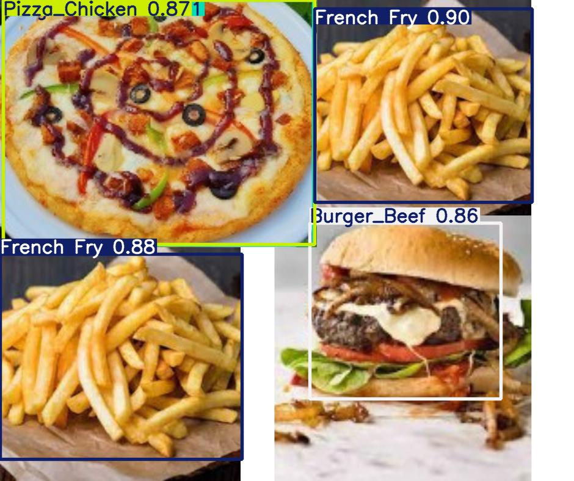
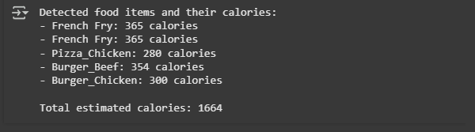
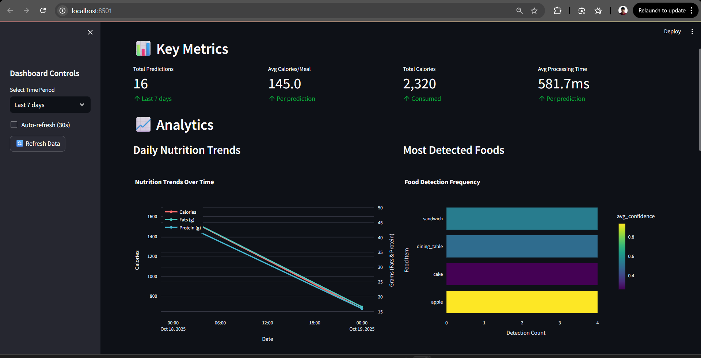
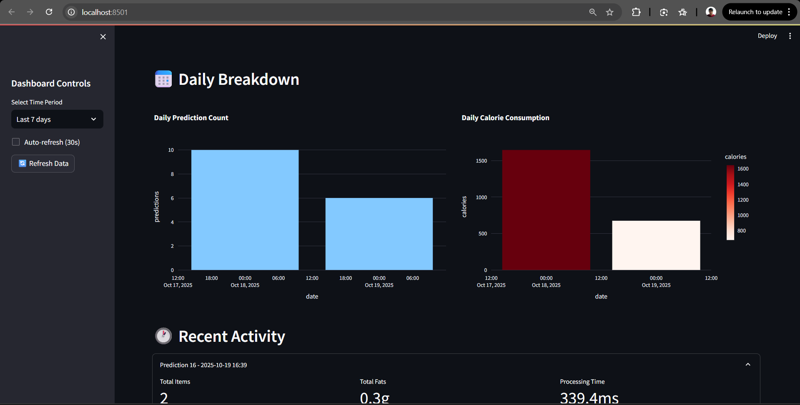
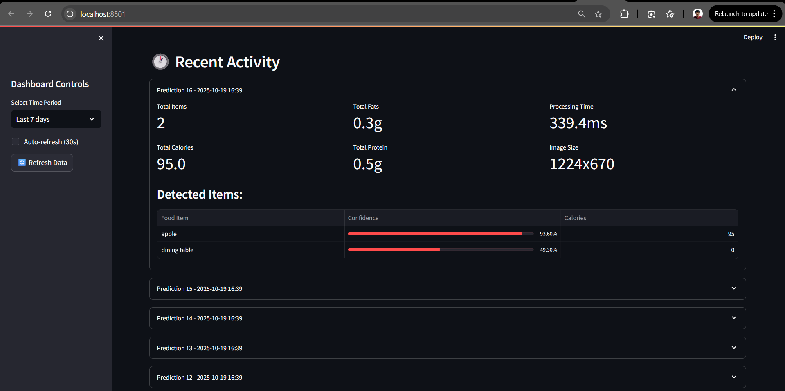

#  Calorie Estimation Model

## 🎬 DEMO

<video controls src="Screen Recording 2025-09-07 020911.mp4" title="Calorie Estimation Demo"></video>

## Results



## Dashboard




## 🚀 Features

### Core Features
- **Real-time Food Detection**: Uses YOLOv8 to identify multiple food items in a single image
- **Top-3 Predictions**: Get the top 3 food matches with confidence scores
- **Adaptive UI**: Different workflows for high-confidence (≥70%) vs low-confidence predictions
- **User Confirmation**: Review and confirm AI predictions or choose alternatives
- **Manual Entry**: Enter custom food items when the model doesn't recognize the food
- **Standard Portion Sizes**: User-friendly portion selection (plate, bowl, cup, spoon)

### Food Categories
- **Multi-Class Detection**: Trained to recognize various food categories:
  - Burgers (Beef & Chicken)
  - French Fries
  - Pizza
  - Fried Chicken
  - Chow Mein
  - Fruits (Apple, Watermelon, Tomato)
  - Boiled Eggs
  - And more...

### Nutrition & Analytics
- **Nutritional Information**: Beyond calories - get protein, fats, and fiber content
- **Integrated Dashboard**: View analytics without leaving the app
  - Total meals and calories tracked
  - Daily calorie intake trends
  - Top foods consumed
  - Recent activity log
- **Prediction Logging**: All predictions and confirmations stored in SQLite database
- **High Accuracy**: Model trained on diverse food dataset
- **Fast Inference**: Real-time detection capabilities

## 📋 Prerequisites

- Python 3.8+
- CUDA-capable GPU (recommended)
- Required packages:
  ```
  ultralytics==8.2.103
  roboflow==1.1.48
  PIL
  numpy
  ```

## 🛠️ Installation

1. **Clone the repository**

   ```bash
   git clone https://github.com/Kyvra-Labs-Pvt-Ltd/Calorie-Estimation-Model.git
   cd Calorie-Estimation-Model
   ```

2. **Install dependencies**

   ```bash
   pip install -r requirements.txt
   ```

3. **Download the trained model**
   ```python
   from roboflow import Roboflow
   rf = Roboflow(api_key="YOUR_API_KEY")
   project = rf.workspace("ayush-trial-workspace").project("calorie-detection-iweay-czyjv")
   dataset = project.version(1).download("yolov8")
   ```

## 💻 Usage

### Quick Start

The easiest way to run the application is using the startup script:

```powershell
# Windows PowerShell
.\start_all.ps1
```

This will start:
- Backend API on http://localhost:8000
- Frontend on http://localhost:8080

Or start manually:

**Terminal 1 - Backend:**
```powershell
cd backend
python -m uvicorn main:app --reload
```

**Terminal 2 - Frontend:**
```powershell
cd frontend
python server.py
```

Then open your browser to http://localhost:8080

### Using the Application

1. **Upload Image**: Click or drag-and-drop a food image
2. **Review Prediction**: 
   - High confidence (≥70%): Auto-confirm or view alternatives
   - Low confidence (<70%): Choose from top 3 options
3. **Manual Entry**: Click "Enter Food Manually" to add custom items
4. **Select Portion**: Choose from standard sizes (plate, bowl, cup, spoon)
5. **View Dashboard**: Click the 📊 Dashboard tab to see your analytics

### Training the Model

```python
# Train YOLOv8 model
!yolo task=detect mode=train model=yolov8s.pt data=data.yaml epochs=25 imgsz=800 plots=True
```

### Inference (Programmatic)

```python
from ultralytics import YOLO
from PIL import Image

# Load the model
model = YOLO('runs/detect/train/weights/best.pt')

# Perform inference
results = model.predict(source='your_image.jpg', conf=0.25)

# Process results
for r in results:
    im_array = r.plot()
    im = Image.fromarray(im_array[..., ::-1])
    im.save('results.jpg')
```

## 📊 Model Performance

- **Training Results**: View training metrics in `runs/detect/train/results.png`
- **Confusion Matrix**: Available in `runs/detect/train/confusion_matrix.png`
- **Validation Results**: Check validation performance in `runs/detect/train/val_batch0_pred.jpg`

## 🎯 Results

The model achieves:

- High accuracy in food item detection
- Reliable calorie estimation
- Real-time processing capabilities

## 📁 Project Structure

```
calorie-estimation-model/
├── Calorie-count-model-final.ipynb  # Main notebook
├── data/                           # Dataset directory
│   ├── train/
│   ├── valid/
│   └── test/
├── runs/                           # Training outputs
├── models/                         # Saved models
└── sample_images/                  # Example images
```

## 🔧 Custom Training

1. **Prepare your dataset**

   - Use Roboflow to annotate images
   - Export in YOLOv8 format

2. **Modify data.yaml**

   - Update class names
   - Adjust paths

3. **Train the model**
   - Adjust epochs and image size
   - Monitor training metrics

## 🤝 Contributing

1. Fork the repository
2. Create a feature branch
3. Commit your changes
4. Push to the branch
5. Open a Pull Request

## 📄 License

This project is licensed under the MIT License - see the LICENSE file for details.

## 🙏 Acknowledgments

- Dataset from Roboflow Universe
- YOLOv8 by Ultralytics
- Nutritional database sources
